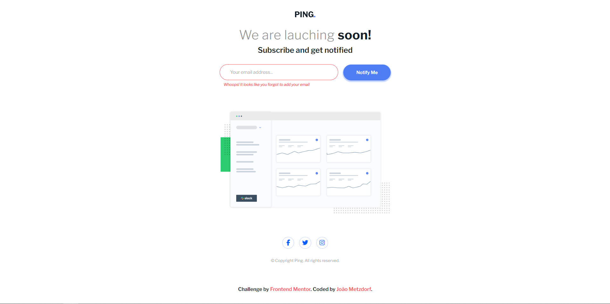

# Frontend Mentor - Ping coming soon page

## Visão geral

### O desafio

Os usuários devem ser capazes de:

- Ver o layout ideal do site dependendo do tamanho da tela do dispositivo
- Ver os estados de foco para todos os elementos interativos na página
- Enviar seu endereço de e-mail usando um campo `input`
- Receba uma mensagem de erro quando o `formulário` for enviado se:
	- O campo `input` está vazio. A mensagem para este erro deve ser *"Whoops! It looks like you forgot to add your email"*
	- O endereço de e-mail não está formatado corretamente (ou seja, um endereço de e-mail correto deve ter esta estrutura: `nome@host.tld`). A mensagem para este erro deve ser *"Please provide a valid email address"*

### Screenshot

### Links

- Live Site URL: [Add live site URL here](https://your-live-site-url.com)

## Meu processo

### Criado com

- HTML
- CSS
- Flexbox
- JavaScript
- Mobile-first

## Autor

- GitHub - [@joaometzdorf](https://github.com/joaometzdorf)
- Frontend Mentor - [@joaometzdorf](https://www.frontendmentor.io/profile/joaometzdorf)